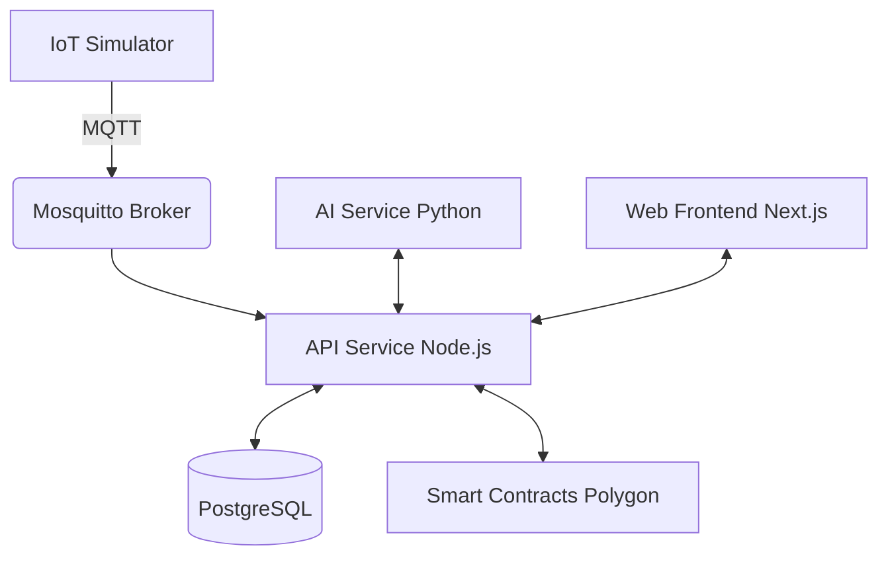

# HONEY CHAIN
```text
 _   _                           _____ _           _       
| | | |                         /  __ \ |         | |      
| |_| | ___  _ __  ___ _   _    | /  \/ |__   __ _| |__  
|  _  |/ _ \| '_ \/ _ \ | | |   | |   | '_ \ / _` | '_ \ 
| | | | (_) | | | |  __/ |_| |   | \__/\ | | | (_| | | | |
\_| |_/\___/|_| |_|\___|\__, |    \____/_| |_|\__,_|_| |_|
                         __/ |                             
                        |___/                              
```
**Blockchain-Verified Honey Traceability Platform**

Honey Chain ensures 100% transparency in the honey supply chain from hive to home. By combining IoT sensors in apiaries, AI-driven health monitoring, and blockchain-backed traceability, we empower beekeepers and assure consumers of pure, unadulterated honey.

## Features
- **IoT Hive Monitoring**: Track temperature, humidity, and weight in real-time.
- **AI Health Analysis**: Detect colony stress and predict yield.
- **Blockchain Traceability**: Immutable batch records on Polygon Amoy testnet.
- **Role-Based Workflows**: Dedicated dashboards for beekeepers, inspectors, processors, and consumers.

## Architecture



## Tech Stack
| Component | Technology |
| --- | --- |
| Frontend | Next.js, Tailwind CSS |
| Backend API | Node.js, Express, Prisma |
| AI Service | Python, FastAPI |
| Database | PostgreSQL |
| Blockchain | Hardhat, Ethers.js, Polygon |
| IoT | Eclipse Mosquitto, MQTT |

## Quick Start
See [docs/SETUP.md](docs/SETUP.md) for full instructions.

## Demo Scenario
1. Login as Beekeeper: View 12 simulated hives (1 warning, 1 critical).
2. IoT Simulator: Pumps telemetry data every 10s.
3. AI Service: Generates alerts for stressed hives.
4. Supply Chain: Track Batch 1 from Apiary to Sold with QR Code.

## License
MIT License
