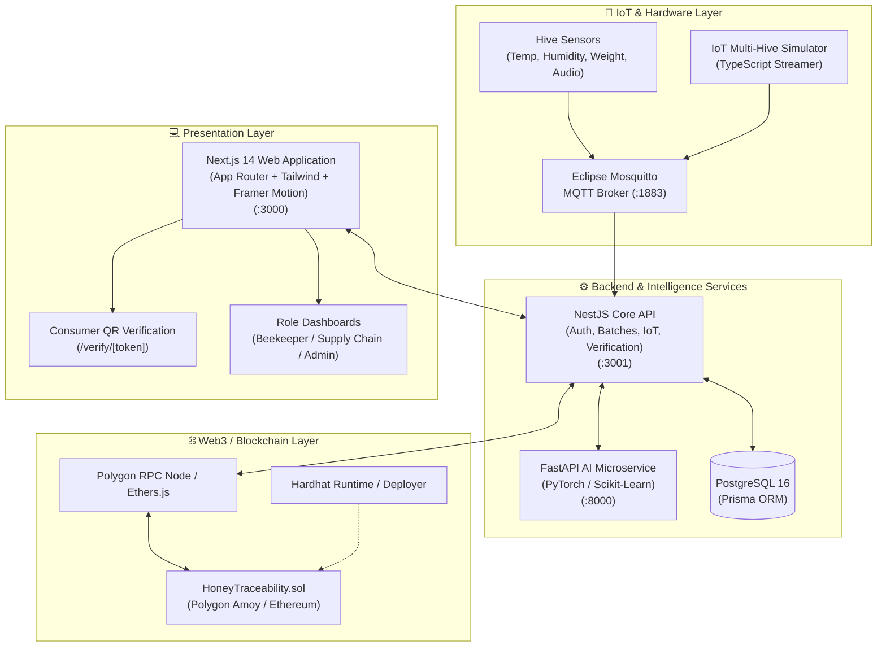

# 🍯 HoneyChain — From Hive to Home, Every Drop Has a Story

<div align="center">

[](https://nextjs.org/)
[](https://nestjs.com/)
[](https://fastapi.tiangolo.com/)
[](https://soliditylang.org/)
[](https://www.prisma.io/)
[](https://polygon.technology/)
[](https://turbo.build/)
[](LICENSE)

**An Enterprise-Grade, Blockchain-Verified Honey Supply Chain & IoT Hive Intelligence Platform**

[Key Features](#-key-features) • [System Architecture](#-system-architecture) • [Smart Contracts](#-smart-contract-architecture) • [Quick Start](#-quick-start) • [Demo Walkthrough](#-demo-walkthrough) • [Project Structure](#-project-structure) 
Deployed link - https://honey-chain-web-dvhb.vercel.app/

</div>

---

## 📌 Executive Summary

Honey is the **3rd most adulterated food in the world**, frequently diluted with high-fructose corn syrup, rice syrup, and artificial coloring while masking geographical origin. Concurrently, beekeepers face unprecedented colony loss due to Varroa mite infestations, foulbrood diseases, and climate instability.

**HoneyChain** solves this crisis through a zero-trust, end-to-end traceability and apiary intelligence platform:
1. **IoT Sensor Ingestion & Health Engine**: Real-time telemetry monitoring (temperature, humidity, acoustics, weight) computes live Hive Health Scores ($0-100$).
2. **AI Disease Diagnosis & Yield Prediction**: PyTorch & Scikit-Learn microservices diagnose colony stress and forecast honey yields.
3. **Immutable Blockchain Ledger**: Ethereum / Polygon smart contracts anchor cryptographic batch state hashes at each supply chain stage.
4. **Interactive Consumer Verification**: Consumers scan unique on-jar QR codes to inspect the full immutable lifecycle—from apiary coordinates and lab purity certificates to on-chain transaction proofs.

---

## 🌟 Key Features

### 🐝 1. Smart Apiary & IoT Hive Monitoring
- **Real-Time Telemetry**: Collects internal/external temperature, relative humidity, hive weight, and acoustic frequency (bee humming).
- **Automated Health Engine**: Dynamically calculates hive vitality scores and triggers alerts for swarming, brood chilling, or robbing behavior.
- **Interactive Visualizations**: Time-series charts for multi-sensor trends and acoustic frequency distributions.

### 🧠 2. AI-Driven Apiary Diagnostics
- **Colony Disease Classification**: Image and acoustic deep learning models classifying healthy hives, Varroa destructor mites, American Foulbrood (AFB), and European Foulbrood (EFB).
- **Harvest Yield Regressor**: Forecasts seasonal yield based on historical brood metrics, floral forage conditions, and colony strength.

### ⛓️ 3. Polygon Smart Contract Traceability
- **Role-Based Access Control (RBAC)**: Enforces cryptographic permissions across `Admin`, `Beekeeper`, `Processor`, `QualityInspector`, and `Distributor`.
- **Gas-Optimized State Anchoring**: Off-chain metadata is hashed (`keccak256`) and anchored on-chain with packed storage structures.
- **Tamper-Evident State Machine**: Linear stage progression from `Harvested` $\rightarrow$ `Collected` $\rightarrow$ `QualityTested` $\rightarrow$ `Processed` $\rightarrow$ `Packaged` $\rightarrow$ `InTransit` $\rightarrow$ `Delivered` (with emergency `Recalled` state).

### 📱 4. Consumer Provenance Portal
- **Instant QR Verification**: Dedicated `/verify/[batchToken]` verification page.
- **Full Provenance Timeline**: Interactive map of apiary origin, floral source details, harvesting date, lab test results (sugar ratio, moisture %, pollen profile), and Polygonscan transaction links.

### 💼 5. Specialized Multi-Role Dashboards
- **Beekeeper Portal**: Manage apiary locations, monitor hives, view AI recommendations, log harvest batches.
- **Processor & Lab Portal**: Record batch processing, pasteurization levels, laboratory purity tests, and generate packaging QR codes.
- **Admin & Inspector Portal**: Monitor platform-wide metrics, oversee registered supply chain actors, and conduct audits.

---

## 🏗️ System Architecture



---

## 🔐 Smart Contract Architecture

The smart contract [`HoneyTraceability.sol`](contracts/contracts/HoneyTraceability.sol) provides strict cryptographic provenance:

### State Machine Lifecycle
```
[ 1. Harvested ] ──────> [ 2. Collected ] ──────> [ 3. QualityTested ]
       │                                                    │
       ▼                                                    ▼
[ 8. Recalled ] ◄─────────────────────────────────── [ 4. Processed ]
       ▲                                                    │
       │                                                    ▼
[ 8. Recalled ] ◄─────── [ 6. InTransit ] ◄───────── [ 5. Packaged ]
                                │
                                ▼
                        [ 7. Delivered ]
```

### Key Contract Methods
| Function | Access Role | Description |
| :--- | :--- | :--- |
| `createBatch(batchId, initialHash)` | `BEEKEEPER_ROLE` | Registers initial harvest batch with origin hash |
| `recordEvent(batchId, stage, dataHash)` | Authorized Role | Transitions stage and anchors verifiable cryptographic hash |
| `transferOwnership(batchId, newOwner)` | Current Owner | Handover custody between supply chain participants |
| `recallBatch(batchId, reason)` | `ADMIN` / `QUALITY_INSPECTOR` | Flags batch as recalled with immutable audit reason |
| `getBatchHistory(batchId)` | Public / Consumer | Fetches full chronological audit trail and verification hashes |

---

## 📁 Project Structure

```text
HoneyChain/
├── apps/
│   └── web/                         # Next.js 14 App Router frontend application
│       ├── app/                     # Next.js App Router pages (Auth, Dashboards, Verify)
│       ├── components/              # UI components (Landing, Hive, Batch, Motion, UI)
│       ├── contexts/                # AuthContext & global state providers
│       ├── hooks/                   # Custom API and authentication hooks
│       └── lib/                     # API client, utilities, and constants
├── services/
│   ├── api/                         # NestJS Backend API microservice
│   │   └── src/
│   │       ├── modules/             # Auth, Hives, Batches, IoT, AI, Blockchain, Verification
│   │       ├── common/              # Guards, interceptors, decorators, and enums
│   │       └── prisma/              # Prisma database client integration
│   ├── ai-service/                  # FastAPI Machine Learning diagnostic service
│   │   ├── app/                     # Model inference endpoints and Pydantic schemas
│   │   ├── training/                # Synthetic data generation and PyTorch training scripts
│   │   └── weights/                 # Model weight checkpoints (.gitkeep)
│   └── iot-simulator/               # Standalone IoT sensor telemetry generator
├── contracts/                       # Hardhat Web3 suite
│   ├── contracts/                   # Solidity smart contracts (HoneyTraceability.sol)
│   ├── scripts/                     # Deployment and RBAC setup scripts
│   └── test/                        # Automated contract test suite
├── packages/
│   ├── database/                    # Prisma ORM schema, client export, and seeds
│   ├── types/                       # Shared TypeScript domain interfaces
│   └── config/                      # Shared Tailwind presets and tsconfig
├── infrastructure/
│   └── docker/                      # Docker Compose for PostgreSQL & Mosquitto MQTT
├── docs/                            # Architecture specifications, PRD, and guides
├── turbo.json                       # Turborepo task pipeline configuration
├── pnpm-workspace.yaml              # Monorepo workspace definitions
├── start-all.ps1                    # One-click Windows PowerShell orchestrator
└── README.md                        # Master project documentation
```

---

## 🚀 Quick Start

### 📋 Prerequisites
- **Node.js**: `v20.0.0+`
- **Package Manager**: `pnpm v9.0.0+`
- **Python**: `3.10+` or `3.11+`
- **Docker & Docker Compose**: Installed and running

---

### 1️⃣ Clone & Install Dependencies

```bash
git clone https://github.com/TanishqBhosle/HoneyChain.git
cd HoneyChain

# Install all monorepo dependencies
pnpm install
```

---

### 2️⃣ Environment Configuration

Copy the example environment file:
```bash
cp .env.example .env
```

*Default environment variables are pre-configured for local Docker development.*

---

### 3️⃣ Start Infrastructure (Database & MQTT Broker)

```bash
cd infrastructure/docker
docker-compose up -d
cd ../..
```

---

### 4️⃣ Database Migration & Seeding

```bash
# Generate Prisma Client & apply migrations
pnpm db:generate
pnpm db:migrate

# Seed realistic demo data (Apiaries, Hives, Batches, Users)
pnpm db:seed
```

---

### 5️⃣ Run Services

#### Option A: One-Click Startup (PowerShell)
```powershell
.\start-all.ps1
```

#### Option B: Individual Service Startup
```bash
# Terminal 1 — Full Monorepo Dev (Web + API + Simulator)
pnpm dev

# Terminal 2 — AI Service (FastAPI)
cd services/ai-service
pip install -r requirements.txt
uvicorn app.main:app --port 8000 --reload
```

---

## 🌐 Service Access Points

| Service | Port | Local URL | Documentation / Swagger |
| :--- | :--- | :--- | :--- |
| **Web Frontend** | `3000` | [http://localhost:3000](http://localhost:3000) | Landing, Dashboards & Consumer Portal |
| **NestJS Backend API** | `3001` | [http://localhost:3001](http://localhost:3001) | REST API endpoints & WebSocket feeds |
| **AI ML Service** | `8000` | [http://localhost:8000](http://localhost:8000) | [http://localhost:8000/docs](http://localhost:8000/docs) (Swagger) |
| **Mosquitto MQTT** | `1883` | `mqtt://localhost:1883` | Sensor ingestion topic: `honeychain/+/telemetry` |
| **Prisma Studio** | `5555` | `pnpm db:studio` | GUI database browser |

---

## 🧪 Testing

### Smart Contracts (Hardhat)
```bash
pnpm contract:compile
pnpm contract:test
```

### End-to-End Database & Verification Suite
```bash
npx tsx packages/database/test_e2e_suite.ts
```

---

## 🎬 Demo Walkthrough

1. **Explore Landing Page**: Open `http://localhost:3000` to interact with the cinematic honey drop animations, bee flight canvas scenes, and problem breakdown.
2. **Login as Beekeeper**:
   - Navigate to `/login` and sign in with demo credentials.
   - Inspect the **Apiaries & Hives Dashboard** to observe live streaming sensor telemetry.
   - Click on an alerted hive to trigger AI health diagnosis.
3. **Harvest a Batch**:
   - Create a new honey harvest batch from Apiary 1 (Wildflower Raw Honey).
4. **Supply Chain Processing**:
   - Transition the batch status from `Harvested` $\rightarrow$ `QualityTested` $\rightarrow$ `Packaged`.
   - The platform generates a unique cryptographic hash and QR code.
5. **Consumer Provenance Verification**:
   - Navigate to `/verify/HC-BATCH-DEMO-001` (or scan generated QR code).
   - Verify origin coordinates, beekeeper details, lab moisture content, and blockchain immutability proof.

---

## 🛡️ Security & Privacy

- **No Secrets Committed**: All `.env` and sensitive configurations are strictly ignored.
- **Hash-Only On-Chain Storage**: Raw private business data remains encrypted off-chain in PostgreSQL; only `keccak256` digest hashes and state flags are anchored on the blockchain.
- **Strict Role-Based Authorization**: Endpoints are protected by JWT Bearer tokens and NestJS Role Guards matching smart contract permissions.

---

## 📜 License

This project is open-source and licensed under the **[MIT License](LICENSE)**.

---

<div align="center">
  <sub>Built with 💛 by <strong>Tanishq Bhosle</strong> • HoneyChain © 2026</sub>
</div>
